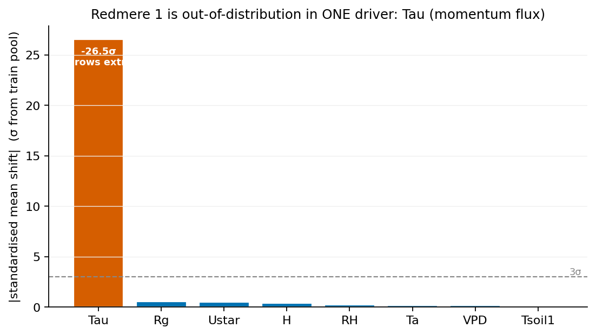
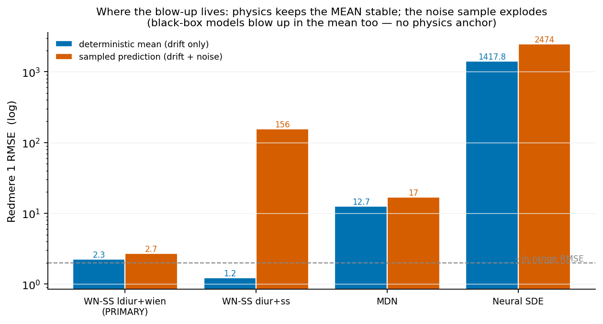
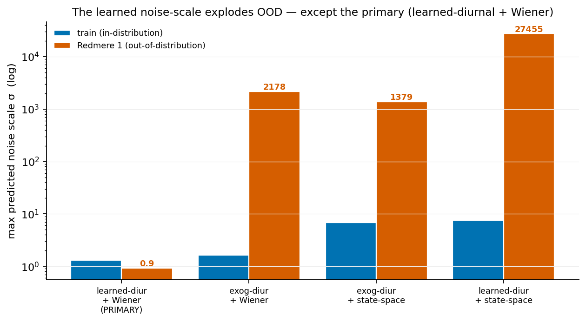

# Why every learned‑noise model blows up on Redmere 1 — and why the primary WienerNet does not

*A root‑cause analysis of the Redmere‑1 out‑of‑distribution failure in the leave‑one‑site‑out
sweep. The headline result: the blow‑up is **not** caused by Redmere 1 having less data. It is
caused by a **single corrupted driver channel** (the turbulent momentum flux `Tau`, off by 4–5
orders of magnitude) that drives the **unbounded learned noise‑scale heads** to astronomical
values. The physics‑anchored mean is immune to it, so the primary WienerNet — physics drift +
learned‑diurnal regularisation + single‑Wiener noise — degrades gracefully where the
alternatives fail by 100–1000×.*

Evidence: `analysis/redmere1/investigate.py` (→ `investigate.json`) and
`analysis/redmere1/plots.py` (→ `figs/R1_*.png`). All numbers below are measured on the
`redmere_1`‑held‑out runs in `outputs/ss_loso/` and `outputs/final_loso/`.

---

## 1. The symptom

In the leave‑one‑site‑out sweep, holding out **Redmere 1** makes the one‑step sampled‑prediction
RMSE explode for almost every learned model, while temperature‑only physics and the trees stay
sane:

| model (Redmere 1, seed 0) | sampled RMSE | in‑range RMSE (Rosedene) |
|---|---|---|
| **WN‑SS learned‑diurnal + Wiener (PRIMARY)** | **2.7** | 1.9 |
| WN‑SS exogenous‑diurnal + Wiener | 117 | 1.9 |
| WN‑SS exogenous‑diurnal + state‑space | 156 | 2.0 |
| WN‑SS learned‑diurnal + state‑space | 1005 | 1.9 |
| MDN (no physics) | 17 (mean already 12.7) | 2.2 |
| Neural SDE | 2474 (mean 1418) | 2.1 |
| Analytical SDE (const noise, pure physics) | 2.0 | 2.3 |
| Random Forest / XGBoost | 1.3 / 1.4 | 1.6 / 1.7 |

Redmere 1 *does* have the least usable data (5,464 rows after dropping NaNs, vs 10–25 k for the
other sites; a 62 % NaN loss from the raw 14 k). But data quantity cannot explain a **100–1000×**
RMSE explosion that hits the neural models and spares the physics ones on the *same* data. The
cause is specific, and measurable.

---

## 2. Root cause I — a single corrupted driver (`Tau`)

Redmere 1 is **not** out‑of‑distribution in the variables that matter physically. Its air
temperature range (−5.9 … 24.7 °C) is the *narrowest* of the five sites, its flux magnitude the
*smallest* (max 23.5 vs 32–40 elsewhere), and its Lloyd–Taylor parameters `E0, rb` are
mid‑range. Standardised against the training pool, **seven of the eight drivers are essentially
in‑distribution** (|mean shift| ≤ 0.6 σ). One is not:

| driver | standardised mean shift | rows beyond the whole training 1–99 % range |
|---|---|---|
| **Tau (momentum flux)** | **−26.5 σ** | **18.7 %** |
| Rg | +0.58 σ | 1.0 % |
| Ustar | +0.50 σ | 1.2 % |
| H, RH, Ta, VPD, Tsoil1 | ≤ 0.4 σ | ≤ 4.4 % |

*(Mahalanobis distance of the Redmere‑1 driver mean from the training distribution = 31.8,
essentially all of it from `Tau`.)*

The raw values show why — `Tau` at Redmere 1 is physically impossible:

| site | Tau median | Tau 1 % | Tau 99 % | Tau min | Tau max |
|---|---|---|---|---|---|
| Rosedene | 0.036 | 0.001 | 0.66 | 0.00 | 9.7 |
| Woodwalton | −0.044 | −0.49 | 0.005 | −6.9 | 9.1 |
| Redmere 2 | −0.062 | −0.54 | 0.007 | −8.0 | 7.7 |
| Great Fen | 0.043 | 0.001 | 0.56 | 0.00 | 2.2 |
| **Redmere 1** | −0.039 | **−2 983** | **+3 304** | **−34 775** | **+78 984** |

Momentum flux (kg m⁻¹ s⁻²) is `O(0.01–1)` at every site — *including Redmere 1's median*. But
Redmere 1's tails run to **±10⁴–10⁵**: a **sensor / units / unconverted‑raw‑counts artifact** on
the `Tau` channel affecting ~19 % of its nighttime rows. This corrupted column is one of the
eight encoder inputs.

---

## 3. Root cause II — the failure chain: corrupted driver → unbounded noise scale → heavy‑tailed sample

The blow‑up propagates through the *learned* path, and we can localise it precisely.

### 3.1 It is the noise sample, not the drift

Splitting each model's RMSE into its **deterministic mean** (`nee_mean = NEE_t + drift·Δt`, no
noise) and its **sampled prediction** (`nee = mean + ε·σ`) is decisive:

| model (Redmere 1) | deterministic‑mean RMSE | sampled RMSE | blow‑up factor |
|---|---|---|---|
| **WN‑SS learned‑diurnal + Wiener (PRIMARY)** | 2.3 | **2.7** | **1.2×** |
| WN‑SS exog‑diurnal + Wiener | **1.2** | 117 | 95× |
| WN‑SS exog‑diurnal + state‑space | **1.2** | 156 | 127× |
| WN‑SS learned‑diurnal + state‑space | 2.4 | 1005 | 424× |
| MDN (no physics) | 12.7 | 17 | 1.3× |
| Neural SDE | 1418 | 2474 | 1.7× |

For every WienerNet‑SS variant the **deterministic physics mean is stable** (RMSE 1.2–2.4, i.e.
*in‑range* quality) — the explosion is entirely in the **sampled noise**. This is expected from
the model definition: the drift `f_phys` is a function of **temperature** and the **known**
`E0, rb`; the corrupted `Tau` never enters the conditional mean, and the drift clamp
(`c·tanh`, `c = 1`) is a further backstop. The corrupted driver only reaches the output through
the *stochastic* head.

### 3.2 The learned noise‑scale head extrapolates to 10³–10⁴

The noise scale is `σ = softplus(head(z))` with `z = encoder(drivers)`. The head is **unbounded
above** (softplus, only a small positive floor), so an out‑of‑distribution latent code — produced
by the ±10⁴ `Tau` values — drives it arbitrarily large. Measured on the in‑distribution training
pool vs the Redmere‑1 test set:

| variant | σ max (train) | σ max (Redmere 1) |
|---|---|---|
| **learned‑diurnal + Wiener (PRIMARY)** | 1.3 | **0.9** |
| exogenous‑diurnal + Wiener | 1.7 | **2 178** |
| exogenous‑diurnal + state‑space | 6.9 | **1 379** |
| learned‑diurnal + state‑space | 7.6 | **27 455** |

A predictive scale of `σ ≈ 10³–10⁴`, sampled through the heavy‑tailed asymmetric‑Laplace noise
`ε·σ`, produces catastrophic single‑sample predictions on the ~19 % corrupted rows — and the RMSE
is dominated by them. That is the entire failure: **unbounded aleatoric scale × out‑of‑range
input × heavy‑tailed sampling.**

### 3.3 Why the black‑box models are even worse

MDN and Neural SDE have **no physics anchor on the mean** — their conditional mean is itself a
learned function of the drivers (including `Tau`). So their *deterministic mean* already
extrapolates (MDN 12.7, Neural SDE **1418**), before any noise is added. Physics grounding is
what keeps WienerNet‑SS's mean stable; a black box has nothing holding its mean in place, so it
fails in a way no noise‑robustness can repair.

---

## 4. Why the primary WienerNet remains robust

The primary configuration — **known `E0, rb` · learned‑diurnal tendency · exact‑`Reco` drift ·
single‑Wiener noise · no residual** — survives Redmere 1 (RMSE 2.7 at seed 0; 2.7 / 3.1 / 3.8
across seeds 0/1/42 — stable on every seed). Its robustness is **layered**, and each layer is
independently measured above:

1. **The mean is physics, not learning.** The conditional mean is `NEE_t + [Reco(T+ΔT) − Reco(T)]`
   with **known** `E0, rb` — a function of *temperature*, which is in‑distribution at Redmere 1.
   The corrupted `Tau` cannot move the mean (measured: deterministic RMSE 2.3, in‑range). A
   bounded `tanh` drift clamp is a second backstop. *This is the single most important factor* —
   it is why WienerNet's mean stays put while the black‑box means explode by 10–1000×.

2. **The learned‑diurnal auxiliary task regularises the encoder.** Compare the two single‑Wiener
   models, whose *only* difference is the tendency source: exogenous‑diurnal (no tendency head)
   explodes to `σ = 2 178`, while **learned‑diurnal collapses to `σ = 0.9`**. Forcing the shared
   encoder to also predict the smooth physics diurnal tendency (MSE‑anchored) constrains `z` to a
   physically meaningful, smooth representation, so the *downstream noise head* does not blow up
   on the OOD input. The prediction task the user insisted on for scientific reasons turns out to
   be an **OOD regulariser** for free.

3. **Single‑Wiener noise has the smallest learned surface.** The state‑space variant adds a
   second scale head `σ_proc`, and its increment variance `2σ_meas² + σ_proc²·Δt` **amplifies**
   any `σ_proc` extrapolation by the step `Δt`. Measured on `learned‑diurnal + state‑space`: the
   shared `σ_meas` head stays bounded (p99 1.50 → 1.45, protected by factor 2) but the *extra*
   `σ_proc` head extrapolates (p99 0.51 → 1.72) and, multiplied by `Δt`, drives `σ` to 27 455.
   The single‑Wiener head has no such extra, amplified degree of freedom.

4. **Fewer learned heads on the corrupted driver = more robustness.** Turning the residual
   correction **on** (an extra learned drift head reading the same corrupted `Tau`) degrades even
   the primary from RMSE 3.2 → **84.7**. The primary's `residual‑off` setting keeps the learned
   surface minimal, which is exactly what limits OOD exposure. (This is the kind of
   site‑dependent result that justifies reporting residual on/off as an ablation.)

In one sentence: **the primary WienerNet keeps everything that touches the corrupted driver
either physics‑anchored (the mean) or minimally‑ and smoothly‑parameterised (a single,
encoder‑regularised noise head), so a gross single‑channel data fault degrades it gracefully
instead of catastrophically.** The pure‑physics Analytical SDE (RMSE 2.0) and the driver‑only
trees (1.3–1.4) are robust for the same underlying reason — no unbounded learned noise scale —
but they buy it by giving up the calibrated, learned, heavy‑tailed uncertainty that WienerNet‑SS
provides everywhere else.

---

## 5. Honest framing and caveats

* **The correct operational action is data QC, not modelling.** Redmere 1's `Tau` channel is
  physically impossible and should be despiked / unit‑checked / dropped before use. This is a
  data‑quality fault at one site, not a model defect. The analysis's value is (a) explaining the
  symptom precisely and (b) showing which designs *survive* an un‑caught fault.
* **Robust ≠ correct.** The primary's Redmere‑1 RMSE (2.7–3.8) is still worse than the pure‑physics
  Analytical model's (2.0) at this site. WienerNet‑SS is *robust to* the corruption (it degrades
  gracefully and stays usable), not *immune to* it. Its uncertainty band there should be read with
  the structural‑variance caveat from the evaluation methodology.
* **Generalisation of the mechanism.** The failure mode — *unbounded learned noise scale × an
  out‑of‑range input × heavy‑tailed sampling* — is generic. Any site with a sensor fault on any
  encoder driver would reproduce it in the vulnerable variants. The robustness argument for the
  primary therefore transfers beyond this one site.

---

## 6. Recommendations

1. **Clean `Tau` at Redmere 1** (despike / unit‑check, or exclude the channel) and re‑run; the
   OOD gap should close and the vulnerable variants recover. This confirms causation.
2. **Clamp the forward noise scale.** The training loss already clamps `log σ` to `[−7, 5]`
   (`σ ≲ 148`), but the *sampled* forward `σ_eff = softplus(head)` is **not** upper‑bounded — which
   is the exact quantity that reaches 10³–10⁴. Applying the same clamp to `σ_eff` in the forward
   pass is a one‑line, universal safeguard that would bound the sampling explosion for *every*
   variant without changing in‑distribution behaviour. *(Offered as a follow‑up; not yet applied.)*
3. **Winsorise encoder inputs to the training range** as a cheap, general input‑robustification
   (clip each driver at its train 1/99 % percentile) — turns a fault into a bounded degradation.
4. **For the manuscript**, present Redmere 1 as an **OOD‑robustness stress test**, not a
   generalisation failure: physics‑anchored WienerNet (primary), the Analytical prior, and the
   trees survive a gross single‑driver corruption; the learned‑noise/black‑box models do not.
   Report the primary with residual **off** (more robust here) and note the on/off ablation.

---

### Appendix — provenance

* Driver OOD, per‑model σ distributions (train vs Redmere 1), drift‑vs‑noise localisation:
  `analysis/redmere1/investigate.py` → `analysis/redmere1/investigate.json`.
* Figures: `analysis/redmere1/plots.py` → `analysis/redmere1/figs/R1_driver_ood.png`,
  `R1_sigma_explosion.png`, `R1_localisation.png`.
* Per‑site metrics: `outputs/ss_loso/redmere_1_s0_*` and `outputs/final_loso/comp_*_redmere_1_s0`
  (`metrics/per_site.csv`); raw drivers from the site `final_night_data.parquet` files.
